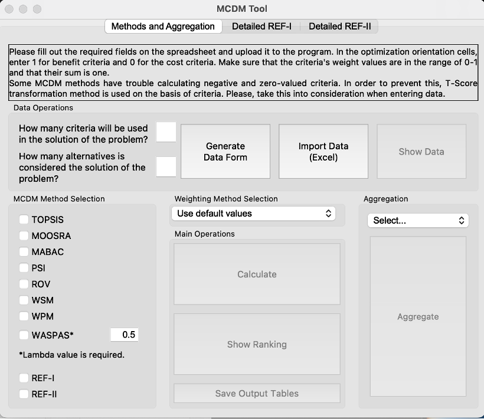
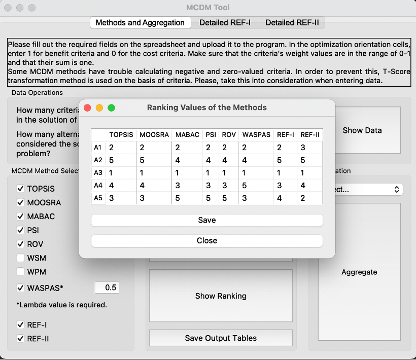
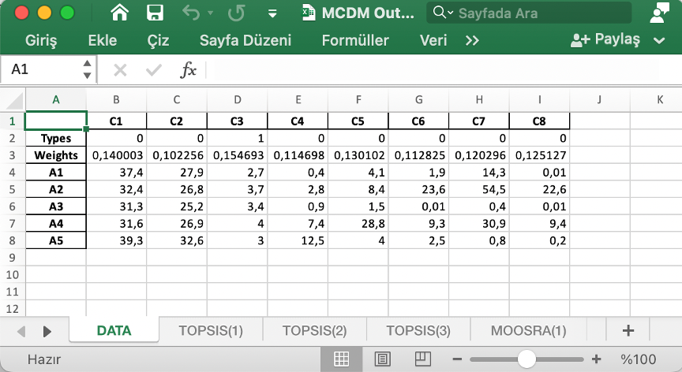
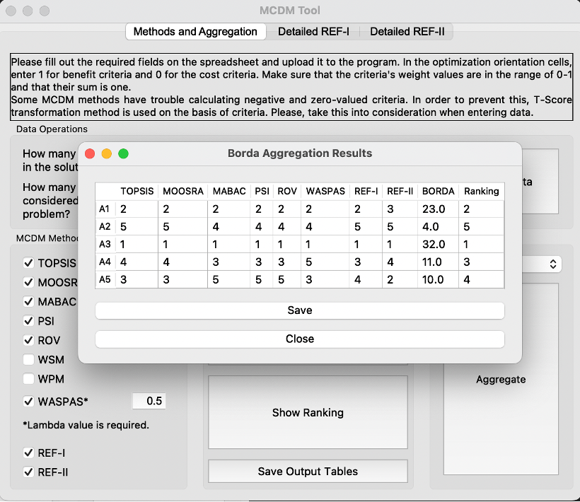

[](https://github.com/kadirkirda/ka-decision)

**Notes**

- If you are Microsoft Windows user, you can [download ka-decision.exe](https://github.com/kadirkirda/ka-decision/raw/refs/heads/main/software/ka-decision.exe). This is the compiled version of the source code.

- To cite this software publication: https://link.springer.com/article/10.1007/s10668-023-03349-z

## ka-decision - Multi-Method MCDM/MCDA Software

**ka-decisions** is a software with a user-friendly interface that makes it possible to use more than one MCDM method at the same time and integrate the results.

## Installation and Launching of ka-decision

**Requirements**
```yaml
python (version >= 3.10)
```

**Installation**

Installation of all of the required packages
```bash
$ pip install -r requirements.txt
```

**Launching**

If you use terminal, go to src folder with cd command. Then:
```bash
$ python main.py
```
If you use Visual Studio Code, run src/main.py file.

## Application Overview

This document describes the **ka-decision** Desktop Application which can run standalone in users computer.

### Features

- Including a number of selected MCDM methods.
- It has an intuitive usage feature. With routing messages, it is possible for the user to understand what to do.
- Excel file format is used for input-output operations.
- It offers the opportunity to use more than one method at the same time.
- Provides detailed process tables for each method in addition to summary results.
- It has the feature of integrating the ranking results.
- In addition, there are solutions for the newly developed REF-I and REF-II methods.

### Usage of The Software

When the software is started, an interface consisting data operations, selection of methods, selection of weighting method, calculation, reporting and aggregation is opened.

 

On this page, if required, empty xlsx file to be imported can be created by the program by entering the criteria and alternative numbers.

In order to import the data, the "Import Data" button should be clicked and the relevant data file should be selected. In case of any error, the program guides the user to make the necessary corrections.

The methods to be included in the calculation are selected from the "MCDM Method Selection" list on the left side of the window.

One of the following options can be preferred for weighting the criteria:
- Default values
- Equal weighting
- Entropy weighting
- Critic weighting

When the "Calculate" button is clicked, all of the calculations are completed.

After that, when the "Show Ranking" button is clicked, the summary results are displayed as seen in below.

 

Detailed tables of the methods included in the calculation can be saved by clicking the "Save Output Tables" button. Each method's application processes are represented by tables on a different page in the xlsx format file.



For the aggregation process, a method is selected in the "Aggregation" section and then the "Aggregate" button is clicked. Currently, only the Borda method is available.

 

 # License

 - [MIT-License](LICENSE)
